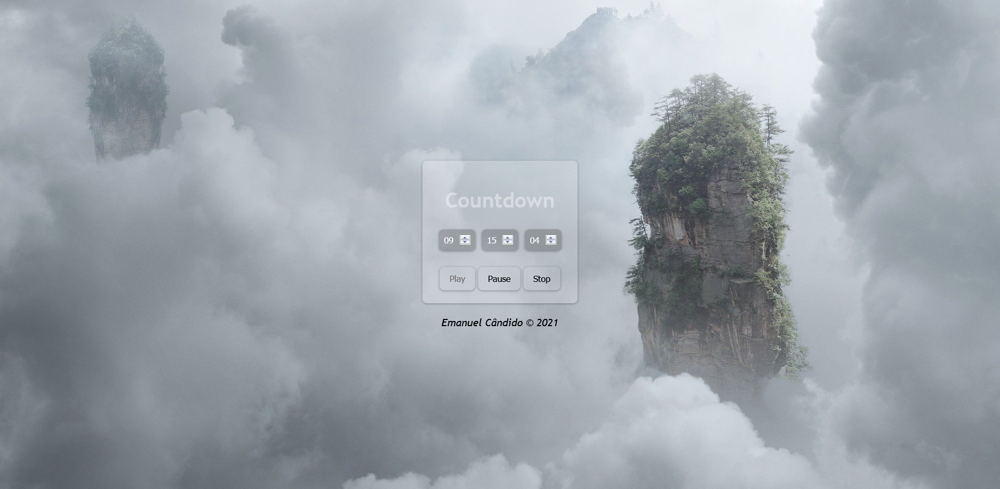

# [Vuejs | Challenge #04](https://emanuelcandido-js.netlify.app/javascript/vuejs/challenges/04_countdown/countdown.html) 🇦🇴

Clique aqui para testar : [Countdown](https://emanuelcandido-js.netlify.app/javascript/vuejs/challenges/04_countdown/countdown.html)

 

Metodos para o aprendizado:

- [VueJS - Curso de Iniciação](https://www.youtube.com/playlist?list=PLXik_5Br-zO_xQHAH9GrNR1gAefYWaKxz)

- [Vuejs do Jeito Ninja](https://www.youtube.com/playlist?list=PLcoYAcR89n-qq1vGRbaUiV6Q9puy0qigW)

- [Documentação do VueJs](https://br.vuejs.org/v2/guide/)

 

### Contribua 🖤

 

---

Feito com 🖤💛❤ por [Emanuel Cândido](https://emanueljosecandido.github.io/)
