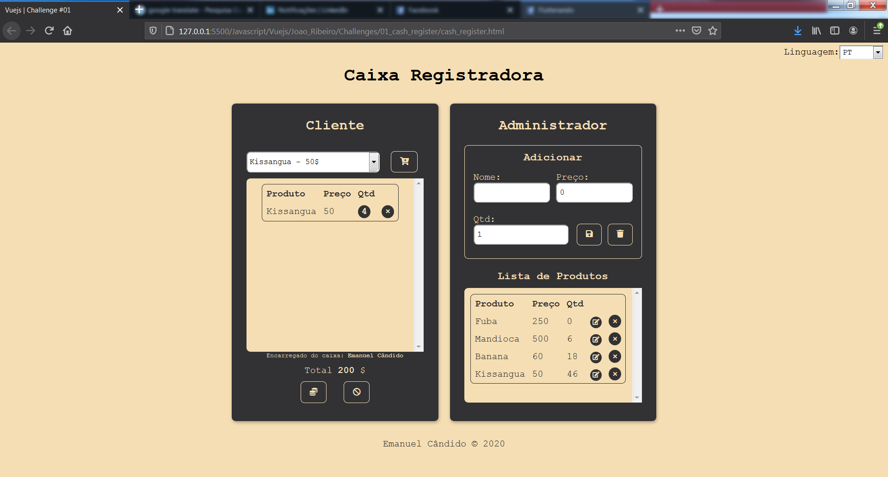

# [Vuejs | Challenge #01](https://emanuelcandido-js.netlify.app/javascript/vuejs/challenges/01_cash_register/cash_register) 🇦🇴

<p align="center">

Clique aqui para testar : [Caixa Registradora](https://emanuelcandido-js.netlify.app/javascript/vuejs/joao_ribeiro/challenges/01_cash_register/cash_register)

<a href="https://emanuelcandido-js.netlify.app/javascript/vuejs/joao_ribeiro/challenges/01_cash_register/cash_register">

</a>

</p>

<br>

## O que é uma Caixa Registradora?

<p align="justify">
    Uma caixa registradora é um dispositivo mecânico ou eletrônico que serve para calcular e registrar transações de venda, e possui uma gaveta para armazenar o dinheiro. 
</p>

Fonte: [Wikipédia](https://pt.wikipedia.org/wiki/Caixa_registradora)

<br>

## [Emanuel Cândido](https://emanueljosecandido.github.io/) porque desenvolver uma Caixa Registradora?

Há princípio quis desenvolver um `To Do list` para consolidar alguns conhecimentos aprendidos durante está semana, e ao desenvolver o `To Do list` achei que deveria tentar fazer algo um que exigira mais de mim, e o que surgiu mesmo foi uma `Caixa Registradora`.

<br>

Ao desenvolver a `Caixa Registradora` aprendi e consolidei os seguintes conceitos:

- [Instalação](https://br.vuejs.org/v2/guide/installation.html)
- [Introdução](https://br.vuejs.org/v2/guide/index.html)
  - [O que é Vue.js?](https://br.vuejs.org/v2/guide/index.html#O-que-e-Vue-js)
  - [Primeiros Passos](https://br.vuejs.org/v2/guide/index.html#Primeiros-Passos)
  - [Renderização Declarativa](https://br.vuejs.org/v2/guide/index.html#Renderizacao-Declarativa)
  - [Condicionais e Laços](https://br.vuejs.org/v2/guide/index.html#Condicionais-e-Lacos)
  - [Tratando Interação do Usuário](https://br.vuejs.org/v2/guide/index.html#Tratando-Interacao-do-Usuario)
  - [Composição com Componentes](https://br.vuejs.org/v2/guide/index.html#Composicao-com-Componentes)
- [A Instância Vue](https://br.vuejs.org/v2/guide/instance.html)
  - [Criando a Instância Vue](https://br.vuejs.org/v2/guide/instance.html#Criando-a-Instancia-Vue)
  - [Dados e Métodos](https://br.vuejs.org/v2/guide/instance.html#Dados-e-Metodos)
  - [Ciclo de Vida da Instância](https://br.vuejs.org/v2/guide/instance.html#Ciclo-de-Vida-da-Instancia)
  - [Diagrama do Ciclo de Vida](https://br.vuejs.org/v2/guide/instance.html#Diagrama-do-Ciclo-de-Vida)
- [Sintaxe de Templates](https://br.vuejs.org/v2/guide/syntax.html)
  - [Interpolações](https://br.vuejs.org/v2/guide/syntax.html#Interpolacoes)
  - [Diretivas](https://br.vuejs.org/v2/guide/syntax.html#Diretivas)
  - [Abreviações](https://br.vuejs.org/v2/guide/syntax.html#Abreviacoes)
- [Dados Computados e Observadores](https://br.vuejs.org/v2/guide/computed.html)
- [Interligações de Classe e Estilo](https://br.vuejs.org/v2/guide/class-and-style.html)
- [Renderização Condicional](https://br.vuejs.org/v2/guide/conditional.html)
- [Renderização de Listas](https://br.vuejs.org/v2/guide/list.html)
- [Interligações em Formulários](https://br.vuejs.org/v2/guide/forms.html)

<br><br>

<p align="justify">
    Caso queiras adicionar um novo idioma siga os seguintes passos:
</p>

<table>
<tbody>

<td>

```js
    // 1.
    // Adicione um novo código(NewCode) no array para
    // ser renderizado: this.languages.push('NewCode');
    //

    renderLanguage: function () {
        this.languages.push('AR');
        this.languages.push('EN');
        this.languages.push('FR');
        this.languages.push('PT');
        this.languages.push('RS');
        this.languages.push('ZH');
        this.languages.push('NewCode');
    },


```

</td>
<td>

```js
    // 2.
    // Adicione-> case 'NewCode': root.newlanguage(); break;

    getLanguage: function () {
        switch (this.selectLanguage) {
            case 'AR': root.languageArabic(); break;
            case 'EN': root.languageEnglish(); break;
            case 'FR': root.languageFrench(); break;
            case 'PT': root.languagePortuguese(); break;
            case 'RS': root.languageRussia(); break;
            case 'ZH': root.languageChinese(); break;
            case 'NewCode': root.newlanguage(); break;
            default: break;
        }
    },
```

</td>
</tbody>
</table>
<table>
<tbody>

<td>

```js
    // 3.
    // Insira os dados traduzidos na nova função: newlanguage()      
    //

    languagePortuguese: function () {
        this.labelLanguage = 'Linguagem';
        this.labelTitle = 'Caixa Registradora';
        this.labelClient = 'Cliente';
        this.labelDefaultOption = 'Escolha um produto';
        this.labelProdut = 'Produto';
        this.labelPrice = 'Preço';
        this.labelQtd = 'Qtd';
        this.labelName = 'Nome';
        this.labelList = 'Lista de Produtos';
        this.labelAdministrator = 'Administrador';
        this.labelAdd = 'Adicionar';
        this.labelEdit = 'Editar';
        this.labelCashier = 'Encarregado do caixa';
        this.labelTotal = 'Total';
        this.labelFinish = 'Comprar';
        this.labelCancel = 'Cancelar';
        this.alertTextName = 'Insira um nome porfavor';
        this.alertTextPrice = 'Insira um preço porfavor';
        this.alertTextNamePrice = 'Insira um nome e um preço porfavor';
        this.alertTextProdutAlready = 'Este produto já foi inserido';
    },
```

</td>
<td>

```js
    // 4.
    // Adicione uma nova função para adicionar 
    // um novo idioma:

    newlanguage(): function () {
        this.labelLanguage = '';
        this.labelTitle = '';
        this.labelClient = '';
        this.labelDefaultOption = '';
        this.labelProdut = '';
        this.labelPrice = '';
        this.labelQtd = '';
        this.labelName = '';
        this.labelList = '';
        this.labelAdministrator = '';
        this.labelAdd = '';
        this.labelEdit = '';
        this.labelCashier = '';
        this.labelTotal = '';
        this.labelFinish = '';
        this.labelCancel = '';
        this.alertTextName = '';
        this.alertTextPrice = '';
        this.alertTextNamePrice = '';
        this.alertTextProdutAlready = '';
    },
```

</td>
</tbody>
</table>

<br>
Metodos para o aprendizado:

- [VueJS - Curso de Iniciação](https://www.youtube.com/playlist?list=PLXik_5Br-zO_xQHAH9GrNR1gAefYWaKxz)

- [Documentação do VueJs](https://br.vuejs.org/v2/guide/)

<br>

### Contribua 🖤

<br>

---

<center>

Feito com 🖤💛❤ por [Emanuel Cândido](https://emanueljosecandido.github.io/)

</center>
