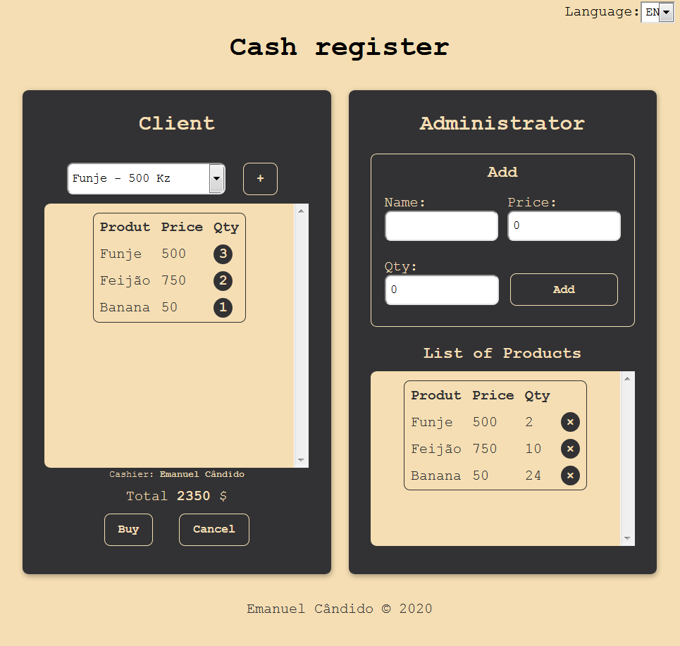

# [Vuejs | Challenge #01](https://emanuelcandido-js.netlify.app/javascript/vuejs/challenges/01_cash_register/cash_register) 🇦🇴

Clique aqui para testar : [Caixa Registradora](https://emanuelcandido-js.netlify.app/javascript/vuejs/challenges/01_cash_register/cash_register)<i></i>

<center></center>

## O que é Caixa Registradora?

<p align="justify">
    Uma caixa registradora é um dispositivo mecânico ou eletrônico que serve para calcular e registrar transações de venda, e possui uma gaveta para armazenar o dinheiro. 
</p>

Fonte: [Wikipédia](https://pt.wikipedia.org/wiki/Caixa_registradora)

## [Emanuel Cândido](https://emanueljosecandido.github.io/) porque desenvolver uma Caixa Registradora?


Há princípio quis apenas desenvolver um `To Do list` para consolidar alguns conhecimentos aprendidos durante está semana, e ao desenvolver o `To Do list` achei que deveria tentar fazer algo um que exigira mais de mim, e o que surgiu mesmo foi uma `Caixa Registradora`.


Ao desenvolver a `Caixa Registradora` aprendi e consolidei os seguintes conceitos:


<ol>
<li>

[Instalação](https://br.vuejs.org/v2/guide/installation.html)

</li>
    <li>Introdução

- [O que é Vue.js?](https://br.vuejs.org/v2/guide/index.html#O-que-e-Vue-js)
- [Primeiros Passos](https://br.vuejs.org/v2/guide/index.html#Primeiros-Passos)
- [Renderização Declarativa](https://br.vuejs.org/v2/guide/index.html#Renderizacao-Declarativa)
- [Condicionais e Laços](https://br.vuejs.org/v2/guide/index.html#Condicionais-e-Lacos)
- [Tratando Interação do Usuário](https://br.vuejs.org/v2/guide/index.html#Tratando-Interacao-do-Usuario)
- [Composição com Componentes](https://br.vuejs.org/v2/guide/index.html#Composicao-com-Componentes)
</li>
<li>A Instância Vue

- [Criando a Instância Vue](https://br.vuejs.org/v2/guide/instance.html#Criando-a-Instancia-Vue)
- [Dados e Métodos](https://br.vuejs.org/v2/guide/instance.html#Dados-e-Metodos)
- [Ciclo de Vida da Instância](https://br.vuejs.org/v2/guide/instance.html#Ciclo-de-Vida-da-Instancia)
- [Diagrama do Ciclo de Vida](https://br.vuejs.org/v2/guide/instance.html#Diagrama-do-Ciclo-de-Vida)
</li>

<li>Sintaxe de Templates

- [Interpolações](https://br.vuejs.org/v2/guide/syntax.html#Interpolacoes)
- [Diretivas](https://br.vuejs.org/v2/guide/syntax.html#Diretivas)
- [Abreviações](https://br.vuejs.org/v2/guide/syntax.html#Abreviacoes)
</li>

<li>

[Dados Computados e Observadores](https://br.vuejs.org/v2/guide/computed.html)

</li>

<li>

[Interligações de Classe e Estilo](https://br.vuejs.org/v2/guide/class-and-style.html)

</li>

<li>

[Renderização Condicional](https://br.vuejs.org/v2/guide/conditional.html)

</li>

<li>

[Renderização de Listas](https://br.vuejs.org/v2/guide/list.html)

</li>


<li>

[Interligações em Formulários](https://br.vuejs.org/v2/guide/forms.html)

</li>
</ol>

<p align="justify">
    Para adicionar produtos ao nosso stoque, o código Javascript(Vuejs) foi o seguinte: 
</p>

```js

                addThings: function () {
                    if (!this.name && this.price) {
                        alert('Insert a name please');
                    }
                    else if (this.name && !this.price) {
                        alert('Insert a price please');
                    }
                    else if (!this.name && !this.price) {
                        alert('Insert a name and a price  please');
                    }
                    else {
                        let name = this.name + " - " + this.price + " Kz";
                        let index = this.things.indexOf(name);

                        if (index == -1) {
                            this.things.push(name);
                            this.qtdThings.push(Number(this.qtdThing));
                            this.prices.push(this.price);
                            this.names.push(this.name);
                            this.copyQtdThings = [...this.qtdThings];
                            root.saveToStorage();
                            root.clearInputAdministratorAdd();
                        }
                        else {
                            this.qtdThings[index] += Number(this.qtdThing);
                            this.copyQtdThings = [...this.qtdThings];
                            root.saveToStorage();
                            root.clearInputAdministratorAdd();
                        }
                    }
                }

```
Metodos para o aprendizado:

*  [VueJS - Curso de Iniciação](https://www.youtube.com/playlist?list=PLXik_5Br-zO_xQHAH9GrNR1gAefYWaKxz)

* [Documentação do VueJs](https://br.vuejs.org/v2/guide/)

---

<center>

Feito com 🖤💛❤ por [Emanuel Cândido](https://emanueljosecandido.github.io/)

</center>

