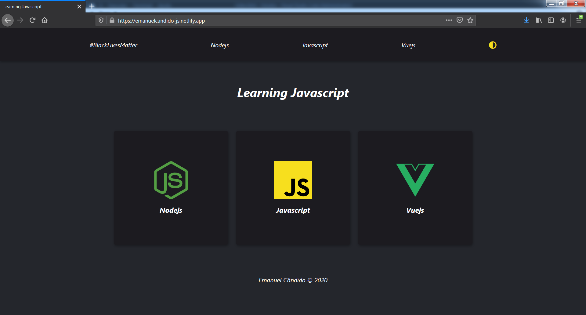

# Learning Javascript(Nodejs, Vuejs) 🇦🇴

    

 

    Repositório criado especificamente para aprender: 

<ol>
    <li>
        
    </li>
    <li>
        
    </li>
    <li>
     
    </li>
</ol>

 

### Contribua 🖤

 

---

Feito com 🖤💛❤ por [Emanuel Cândido](https://emanueljosecandido.github.io/)

